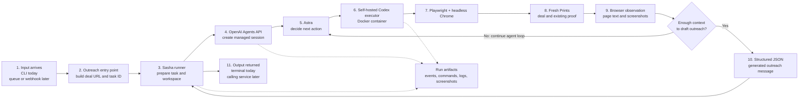

# OpenAI-managed Sasha outreach architecture

## Scope

This POC accepts a Fresh Prints QA deal ID, lets an OpenAI-managed Sasha inspect
the deal and any existing proof, and returns a structured outreach message. It
does not include contract validation, semantic message validation, or an
independent before/after browser checker.

## Architecture

## End-to-end steps

1. A deal ID reaches the outreach entry point. The current input is a terminal
   command; a queue, webhook, or application service can replace it later.
2. The entry point creates the deal URL and a unique task ID.
3. The runner creates a disposable run workspace and copies the authenticated
   browser profile into it.
4. The runner creates an OpenAI Agents API session with the Sasha rules, Astra
   model configuration, JSON response shape, and self-hosted environment.
5. The local Docker container starts `codex exec-server` and connects to that
   managed session.
6. Astra enters the managed agent loop. Astra decides which command to run next;
   the runner does not implement this reasoning loop.
7. Astra uses Node.js and Playwright inside the container to open the supplied
   deal in headless Chrome.
8. If the deal contains an existing proof, Astra follows that proof link and
   inspects it read-only.
9. Browser observations return to Astra. Astra may run another tool step when it
   needs more information. This repeats until Astra has enough context.
10. Astra returns the requested JSON object containing the outreach message.
11. The runner saves session events, tool records, executor logs, screenshots,
    and the result, then removes the disposable browser profile and container.
12. The entry point prints the JSON for the terminal user. A later application
    can consume the same JSON and pass the message to its next workflow.

## Component ownership

| Component | Owner | Responsibility |
| --- | --- | --- |
| Outreach entry point | Sasha repository | Receive a deal ID and print the result |
| Runner | Sasha repository | Session, workspace, timeout, artifacts, and cleanup |
| Outreach rules | Sasha repository | Tell Sasha how to inspect and draft outreach |
| Managed agent loop | OpenAI | Repeatedly choose actions until the task is complete |
| Astra | OpenAI | Interpret observations and generate the outreach |
| Self-hosted executor | Sasha infrastructure | Execute Astra's commands locally |
| Playwright and Chrome | Sasha container | Read Fresh Prints pages |
| Fresh Prints | Fresh Prints | Source deal and proof information |

## Optional verbose output

`--verbose` subscribes a terminal progress reporter to runner milestones and
managed-session events. It does not change the task, agent loop, or JSON result.
Without the flag, the same run stays quiet until the final JSON is printed.
