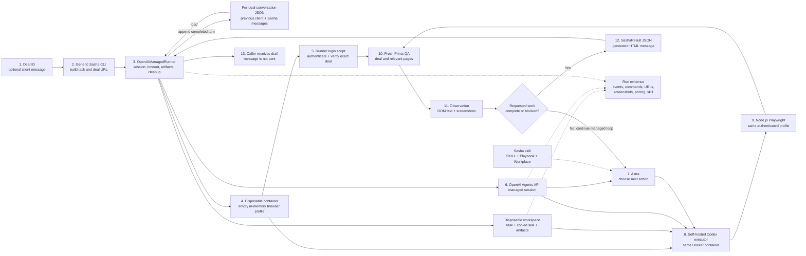

# OpenAI-managed Sasha architecture

## Scope

This POC accepts a Fresh Prints QA deal ID and an optional client message. One
OpenAI-managed Sasha runner handles both modes:

- no client message means initial outreach;
- a supplied client message means a client-response turn.

The application makes no further intent decision. Astra reads the current deal,
uses the `sasha-sales` skill, chooses the relevant workflow, operates the browser,
and returns a structured client-message draft. The POC does not send that message.

There is no contract validator, semantic message validator, or independent
before/after browser checker.

## Architecture

## End-to-end flow

1. The CLI receives a QA deal ID and optional `--message`.
2. The runner derives the conversation filename from the deal ID, creates it
   when needed, and loads that deal's previous ordered conversation.
3. It creates one `SashaTask`. `client_message is None` is the only mode choice
   in Python; no client intent is classified. Previous history and the current
   client message are labeled separately as untrusted data.
4. The runner creates one disposable container with an empty browser profile
   stored in container memory. It also creates a disposable workspace and
   copies the `sasha-sales` capability into it.
5. A fixed runner-owned Playwright script signs in to Fresh Prints QA and
   verifies the exact requested deal page. Credentials arrive over standard
   input and are not stored in the workspace or given to Astra.
6. The authentication browser closes, releasing the profile lock while keeping
   its authenticated state in the running container.
7. The runner creates one OpenAI Agents API session with generic Sasha
   instructions, the shared JSON result schema, and
   `/workspace/capabilities` registered for skill discovery.
8. The same Docker container starts `codex exec-server` and connects the
   self-hosted environment to the managed session.
9. Astra reads the task and skill, launches Playwright with the already
   authenticated in-memory profile, and begins at the exact supplied deal URL.
10. Astra decides which page and Playwright action are needed from the previous
   conversation, current client message, deal history, linked proofs, Playbook,
   and Workplace. Python does not select a quotation, product, stock, proof, or
   revision route.
11. Commands run inside the container. Browser observations return to Astra.
12. Astra repeats the decide-act-observe cycle until the requested work is
   complete or it establishes a real blocker.
13. Astra returns one `SashaResult` JSON object containing the generated HTML
    message or a failure description.
14. The runner saves run evidence, stops the container—which removes the
    in-memory browser profile—and deletes the managed session.
15. For a completed result, the runner atomically appends the current client
    message and exact Sasha HTML to the deal's conversation file. The Sasha
    entry is marked `generated`, not `sent`. Failed turns are not appended.
16. The CLI prints result JSON to stdout. The generated message is not sent.

## Instruction layers

| Layer | File | Responsibility |
| --- | --- | --- |
| Stable agent instructions | `openai_managed/SASHA01_agent_instructions.md` | Sasha identity, QA boundary, untrusted-data rule, prohibited actions, and result requirement |
| Skill routing | `openai_managed/capabilities/sasha-sales/SKILL.md` | Start from the deal, select the workflow, and continue the browser loop |
| Playbook | `openai_managed/capabilities/sasha-sales/references/playbook.md` | Sales judgment, outreach, price and MOQ policy, verification, and client-writing style |
| Workplace | `openai_managed/capabilities/sasha-sales/references/workplace.md` | Fresh Prints page locations, fields, controls, and observed UI behavior |
| Per-run task | `workspace/TASK.md` | Exact deal, turn mode, optional client message, artifacts, and output request |

The stable instructions stay short. Business behavior lives in the skill, and
the Playbook and Workplace can change without adding Python intent routes.

## Component ownership

| Component | Owner | Responsibility |
| --- | --- | --- |
| Generic CLI and task contract | Sasha repository | Accept input and construct one `SashaTask` |
| Per-deal conversation store | Sasha repository | Derive the internal file, load previous turns, and atomically append completed turns |
| Runner | Sasha repository | Fresh authentication, session creation, timeouts, result parsing, progress, pricing, artifacts, and cleanup |
| Sasha skill | Sasha repository | Company policy, sales judgment, workflow guidance, and page knowledge |
| Managed agent loop | OpenAI | Repeated model and command turns until completion or failure |
| Astra | OpenAI | Interpret context, select actions, observe results, and draft the message |
| Self-hosted executor | Sasha infrastructure | Execute Astra's commands in the disposable Docker environment |
| Authentication script | Sasha repository | Sign in and verify the requested deal before Astra starts; never expose credentials to Astra |
| Playwright and Chrome | Sasha container | Authenticate and interact with Fresh Prints QA using one in-memory profile per run |
| Fresh Prints QA | Fresh Prints | Source of current deal, proof, product, price, stock, and workflow state |
| Calling application | Future integration | Decide whether and how to deliver the generated message |

## Output and evidence

The shared result contains:

- `deal_id`
- `status`
- `message_html`
- `failure_code`
- `failure_message`

Each run retains `task.json`, `TASK.md`, the copied skill, non-secret
authentication status, session events, session items, executor logs,
screenshots, visited URLs, best-effort pricing, and `result.json`. The browser
profile exists only in container memory and is removed when the container stops.

Conversation continuity is stored separately from disposable run evidence in
`runs/openai-managed/conversations/DEAL<deal_id>_conversation.json`. The CLI
does not accept a conversation path. One deal never loads another deal's file.

`--verbose` reports runner milestones, Astra commentary, and command status to
stderr. It does not create a second execution path. `--pricing` is also optional
and best effort; missing usage does not fail an otherwise completed turn.

## Current tested boundary

The managed path has been tested for:

- initial outreach from a supplied QA deal;
- one client-response quotation scenario on a linked existing proof;
- two consecutive client-response runs where a fresh second managed session
  received the first run's exact conversation from the per-deal JSON file.

In the quotation scenario, Astra independently started from the deal, followed
the linked proof, entered quantity 40, read the recalculated unit and total
prices, and clicked Cancel instead of Save Price. The returned message was not
sent.

The managed path has not yet been validated for product suggestions,
alternatives, stock and shipping questions, proof creation, attachments, or
revision submission. Those scenarios should extend and test the same skill and
runner rather than add intent-specific Python runners.
